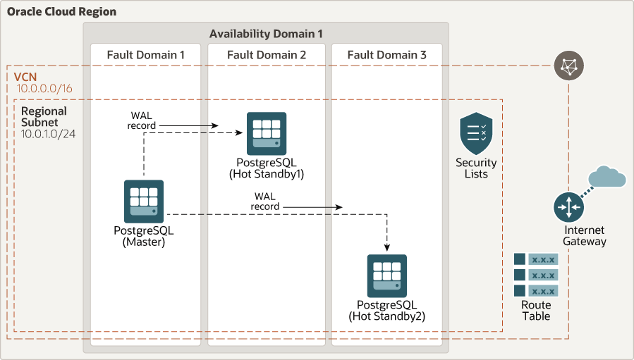

# terraform-oci-arch-postgresql

PostgreSQL is an open source object-relational database management system. It’s highly extensible, highly scalable, and has many features. PostgreSQL supports data replication across multiple data centers.

This reference architecture shows a typical three-node deployment of a PostgreSQL cluster on Oracle Cloud Infrastructure Compute instances. In this architecture, the servers are configured in master and standby configuration and use streaming replication. It will also automatically install postgis34 and pgvector.

For details of the architecture, see [_Deploy a PostgreSQL database_](https://docs.oracle.com/en/solutions/deploy-postgresql-db/index.html)

## Prerequisites

- Permission to `manage` the following types of resources in your Oracle Cloud Infrastructure tenancy: `vcns`, `internet-gateways`, `route-tables`, `security-lists`, `subnets`, and `instances`.

- Quota to create the following resources: 1 VCN, 1 subnet, 1 Internet Gateway, 1 route rules, and 3 compute instances (1 primary master PostgreSQL instance and 2 Standby instances of PostgreSQL).

If you don't have the required permissions and quota, contact your tenancy administrator. See [Policy Reference](https://docs.cloud.oracle.com/en-us/iaas/Content/Identity/Reference/policyreference.htm), [Service Limits](https://docs.cloud.oracle.com/en-us/iaas/Content/General/Concepts/servicelimits.htm), [Compartment Quotas](https://docs.cloud.oracle.com/iaas/Content/General/Concepts/resourcequotas.htm).

## Deploy Using Oracle Resource Manager

1. Click [](https://cloud.oracle.com/resourcemanager/stacks/create?region=home&zipUrl=https://github.com/oracle-devrel/terraform-oci-arch-postgresql/releases/latest/download/terraform-oci-arch-postgresql-stack-latest.zip)

   If you aren't already signed in, when prompted, enter the tenancy and user credentials.

2. Review and accept the terms and conditions.

3. Select the region where you want to deploy the stack.

4. Follow the on-screen prompts and instructions to create the stack.

5. After creating the stack, click **Terraform Actions**, and select **Plan**.

6. Wait for the job to be completed, and review the plan.

   To make any changes, return to the Stack Details page, click **Edit Stack**, and make the required changes. Then, run the **Plan** action again.

7. If no further changes are necessary, return to the Stack Details page, click **Terraform Actions**, and select **Apply**.

## Deploy Using the Terraform CLI

### Clone the Repository

Now, you'll want a local copy of this repo. You can make that with the commands:

    git clone https://github.com/oracle-devrel/terraform-oci-arch-postgresql
    cd terraform-oci-arch-postgresql
    ls

### Prerequisites

First off, you'll need to do some pre-deploy setup. That's all detailed [here](https://github.com/cloud-partners/oci-prerequisites).

Secondly, create a `terraform.tfvars` file and populate with the following information:

```
# Authentication
tenancy_ocid         = "<tenancy_ocid>"
user_ocid            = "<user_ocid>"
fingerprint          = "<finger_print>"
private_key_path     = "<pem_private_key_path>"

# Region
region = "<oci_region>"

# availability Domain
availability_domain_number = "1" # Example: 1, 2, 3

# Compartment
compartment_ocid        = "<compartment_ocid>"

# PostgreSQL Password
# The password must start with a letter, and it can contain letters (uppercase, lowercase), numbers, and the symbols _ $ #
# Minimum length 12 and max is 30
postgresql_password     = "<postgresql_password>"

# PostgreSQL Version (supported versions 9.6, 10, 11, 12, 13, 14)
postgresql_version      = "14"

# Cidr block that will be added in the firewall-cmd trusted zone on the instances running the postgresql server.
# Please add a cidr block from where you run postgresql client.
pg_whitelist_cidr = "" # Example "10.0.0.0/16"


### Using existing network
use_existing_vcn         = true
postgresql_vcn           = "<postgresqls_vcn_ocid>"
postgresql_subnet        = "<postgresql_subnet_ocid>"
create_in_private_subnet = true # In case of deploying in a private subnet, a Bastion Service will be created.


linux_os_version = "8" # (supported versions : 7.9, 8)

# SSH KEY
# If you're using a PRIVATE subnet, the bastion service will be created.
# The code will upload on the instances both the ssh public key that you provide and the one that will be GENERATED.
# The bastion will automatically create sessions for instances using the private key GENERATED.
# If you want to connect using your ssh key, create new sessions with your public key. You can also use the GENERATED ssh key.
ssh_public_key = "<your_public_ssh_key" #optional


# Optional first HotStandby
postgresql_deploy_hotstandby1 = false
# PLEASE LEAVE THE postgresql_hotstandby1_ad = "" (empty string) if you're not using it.
postgresql_hotstandby1_ad = "" # for example 2
postgresql_hotstandby1_fd = "" # for example 2

# Optional second HotStandby
postgresql_deploy_hotstandby2 = false
# PLEASE LEAVE THE postgresql_hotstandby2_ad = "" (empty string) if you're not using it.
postgresql_hotstandby2_ad = "" # for example 1
postgresql_hotstandby2_fd = "" # for example 3


```

### Create the Resources

Run the following commands:

    terraform init
    terraform plan
    terraform apply

### Destroy the Deployment

When you no longer need the deployment, you can run this command to destroy the resources:

    terraform destroy

## Deploy as a Module

It's possible to utilize this repository as remote module, providing the necessary inputs:

```
module "arch-postgresql" {
  source                        = "github.com/oracle-devrel/terraform-oci-arch-postgresql"
  tenancy_ocid                  = "<tenancy_ocid>"
  user_ocid                     = "<user_ocid>"
  fingerprint                   = "<finger_print>"
  private_key_path              = "<private_key_path>"
  region                        = "<oci_region>"
  availability_domain_name       = "<availability_domain_name>"
  compartment_ocid              = "<compartment_ocid>"
  use_existing_vcn              = true # You can inject your own VCN and subnet
  create_in_private_subnet      = true # Subnet should be associated with NATGW and proper Route Table.
  postgresql_vcn                = oci_core_virtual_network.my_vcn.id # Injected VCN
  postgresql_subnet             = oci_core_subnet.my_private_subnet.id # Injected Private Subnet
  postgresql_password           = "<password>"
  postgresql_version            = "14"
  pg_whitelist_cidr             = "" # Example "10.0.0.0/16"
  linux_os_version              = "8"
  ssh_public_key                = "<your_public_ssh_key"
  postgresql_deploy_hotstandby1 = true # if we want to setup hotstandby1
  postgresql_deploy_hotstandby2 = true # if we want to setup hotstandby2
}
```

## Architecture Diagram



## Contributing

This project is open source. Please submit your contributions by forking this repository and submitting a pull request! Oracle appreciates any contributions that are made by the open source community.

## License

Copyright (c) 2024 Oracle and/or its affiliates.

Licensed under the Universal Permissive License (UPL), Version 1.0.

See [LICENSE](LICENSE) for more details.
